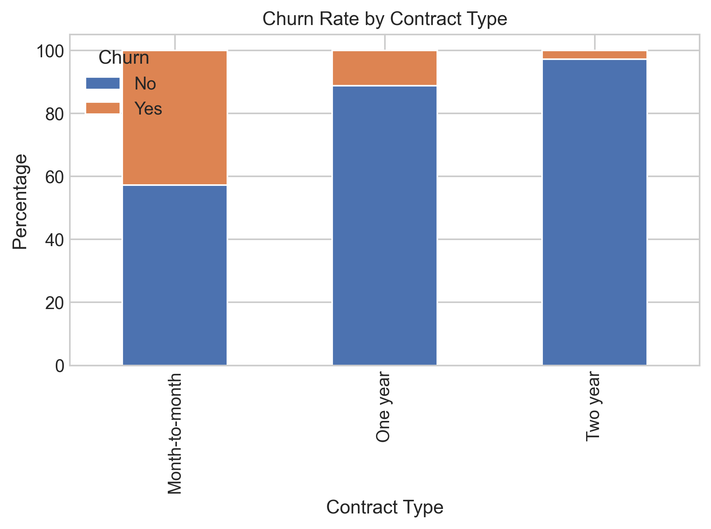
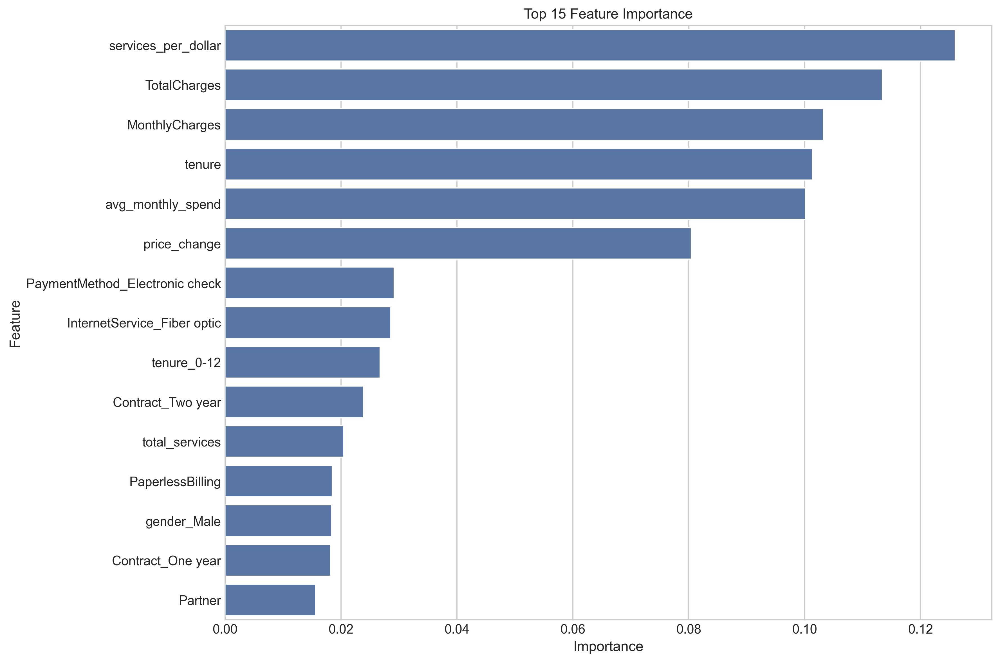
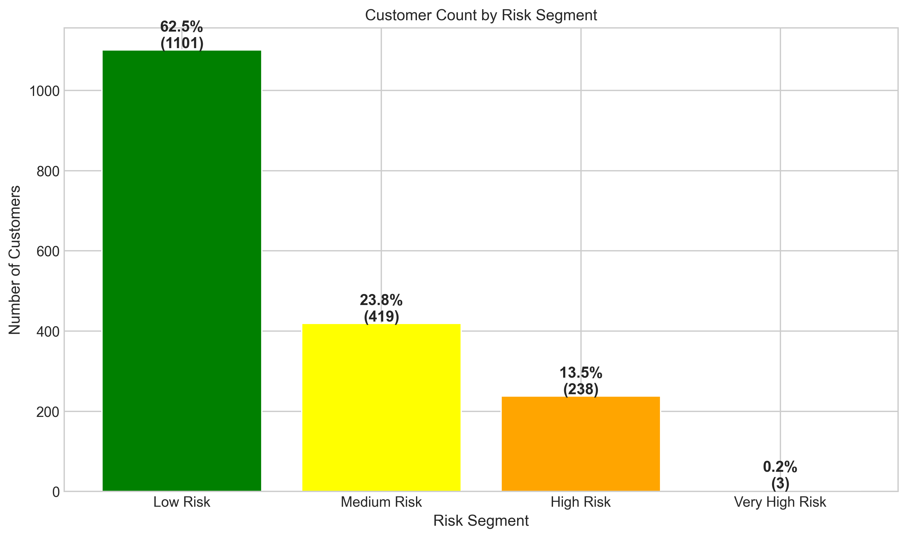

## Interactive Code Execution

The main Python file uses Jupyter-style cell notation (`# %%`) to divide the code into logical sections. This allows for interactive, cell-by-cell execution in compatible editors:

1. **VS Code**: Open the file in VS Code with the Python extension installed to see cell divisions and run each cell separately
2. **Cursor**: Open in Cursor to execute code blocks individually 
3. **PyCharm**: Open in PyCharm with the Jupyter plugin

# Telecom Customer Churn Prediction

## Project Overview
This project predicts customer churn for a telecommunications company using machine learning techniques. By identifying customers at high risk of leaving, the company can implement targeted retention strategies to reduce churn and increase revenue.

## Business Problem
Telecommunications companies face significant challenges with customer churn. Each lost customer represents both lost revenue and increased acquisition costs to replace them. This project addresses this challenge by:

- Building a model to predict which customers are likely to churn
- Identifying key factors that contribute to customer churn
- Recommending targeted retention strategies based on these insights
- Estimating the potential financial impact of implementing these strategies

## Dataset
The analysis uses the Telco Customer Churn dataset, which includes information about:
- Customer demographics (gender, age, partners, dependents)
- Account information (tenure, contract, payment method)
- Services subscribed to (phone, internet, tech support, streaming)
- Churn status

## Methodology
This project follows a comprehensive 10-step data science workflow:

1. **Problem Definition & Business Understanding**
   - Defined the business problem and objectives
   - Identified key stakeholders and success metrics

2. **Data Collection & Understanding**
   - Explored the dataset structure and characteristics
   - Performed initial data quality assessment

3. **Data Preparation & Cleaning**
   - Handled missing values and converted data types
   - Encoded categorical variables for modeling

4. **Exploratory Data Analysis**
   - Analyzed feature distributions and relationships
   - Identified patterns related to customer churn

5. **Feature Engineering & Selection**
   - Created new derived features like services_per_dollar
   - Selected the most relevant predictors

6. **Model Development**
   - Built multiple classification models
   - Compared performance across algorithms

7. **Model Evaluation & Interpretation**
   - Evaluated models using business-relevant metrics
   - Interpreted feature importance for business insights

8. **Data Visualization & Communication**
   - Created executive dashboards and visualizations
   - Developed business-focused recommendations

9. **SQL Integration**
   - Demonstrated database integration for operational use
   - Created SQL views for business users

10. **Deployment Considerations**
    - Outlined implementation roadmap
    - Provided monitoring and maintenance plans

## Key Findings

- **Contract Type**: Month-to-month contracts have a 42.71% churn rate compared to only 2.83% for two-year contracts
- **Tenure**: New customers (0-12 months) have a 47.68% churn rate, which declines to just 6.61% for long-term customers (60-72 months)
- **Internet Service**: Fiber optic customers have a significantly higher churn rate (41.89%) compared to DSL (18.96%)
- **Value-Added Services**: Online Security reduces churn from 41.77% to 14.61%, while Tech Support reduces it from 41.64% to 15.17%
- **Payment Method**: Electronic check users show higher churn rates

## Model Performance
Our best performing model (Gradient Boosting) achieved:
- Accuracy: 78.88%
- Precision: 63.69%
- Recall: 47.32%
- F1 Score: 54.30%
- AUC: 0.8344

## Top Predictive Features
1. Services per dollar (value for money): 0.2669
2. Tenure: 0.2271
3. Payment Method (Electronic check): 0.0787
4. Internet Service (Fiber optic): 0.0784
5. Monthly Charges: 0.0723

## Customer Risk Segmentation
- 62.52% of customers are Low Risk (10.99% actual churn rate)
- 23.79% of customers are Medium Risk (44.87% actual churn rate)
- 13.52% of customers are High Risk (65.13% actual churn rate)
- 0.17% of customers are Very High Risk (100% actual churn rate)

## Business Recommendations

1. **Contract Conversion**: Target month-to-month customers (42.71% churn rate) with incentives to upgrade to longer-term contracts
2. **Early Tenure Focus**: Implement enhanced onboarding and support for customers in their first year (47.68% churn rate)
3. **Service Enhancement**: Promote Online Security services which reduce churn from 41.77% to 14.61%
4. **Support Focus**: Add Tech Support services which reduce churn from 41.64% to 15.17%
5. **Payment Method Review**: Address issues with Electronic Check payment customers who show higher churn rates

## Financial Impact
Implementation of the model-based retention strategy is estimated to:
- Save approximately 40 customers from churning per 1,000 customers
- Deliver a net benefit of $13,500 per 1,000 customers
- Provide an ROI of 50.9% on retention campaign costs

## Technologies Used
- Python
- pandas, NumPy
- scikit-learn, XGBoost
- Matplotlib, Seaborn
- SQLite

## Project Structure
- `src/telecom_churn_prediction.py`: Main Python script with all analysis steps
- `data/`: Dataset files
- `visualizations/`: Generated plots and dashboards
- `model_artifacts/`: Saved model files

## How to Run
1. Clone this repository
2. Install dependencies: `pip install -r requirements.txt`
3. Run the main script: `python src/telecom_churn_prediction.py`

## Future Work
- Development of a real-time prediction API
- Incorporation of customer service interaction data
- A/B testing of different retention strategies
- More granular customer segmentation

## Author
Ochirbat Bayanjargal

## License
This project is licensed under the MIT License - see the LICENSE file for details.
